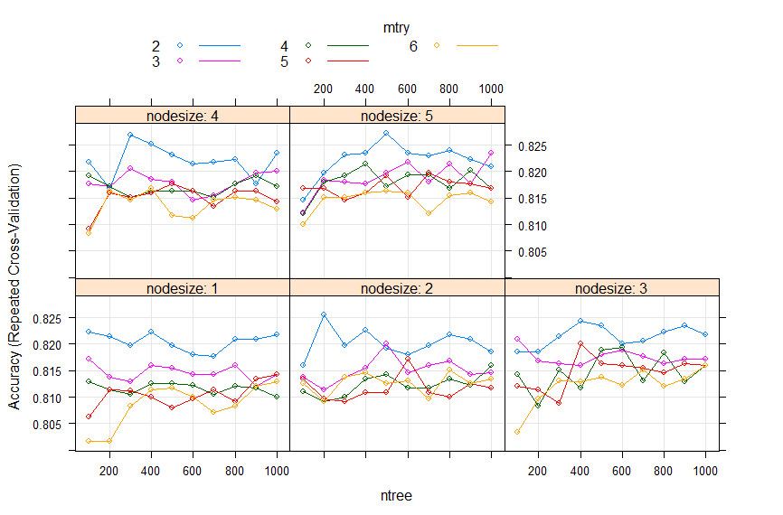

# Heart Disease Classification using Machine Learning

**Description:** 
Sentiment analysis is one application of text classification. This project is about deciding whether a patient is postive or negative. The process model is implemented in a Python script that using LSTM model.


## Load the Data Set

In this article, we’ll use the [Heart Disease Dataset](https://archive.ics.uci.edu/ml/datasets/heart+disease) available from the UCI Machine Learning Repository datasets. This data is from cardiovascular research in residents of the city of Framingham, Massachusetts. The variable used in this article consists of one dependent variable that has a "yes" or "no" value stating whether the patient has heart disease and 14 independent variables. This dataset contains a total of 303 data corresponding to the 'Negative' 164 data and 'Positive' 139 data.

The code below shows how to load dataset from UCI Machine Learning Repository

```R
heart=read.csv("https://archive.ics.uci.edu/ml/machine-learning-databases/heart-disease/processed.cleveland.data",header=FALSE,sep=",",na.strings = '?')
names(heart) <- c( "age", "sex", "cp", "trestbps", "chol","fbs", "restecg","thalach","exang", "oldpeak","slope", "ca", "thal", "target")
heart$target<-ifelse(heart$target==0,0,1)
```


## Data Cleaning and Splitting into Training and Testing Dataset

The code below shows the data cleaning process for each sample in the dataset. Data cleaning is done by removing the missing values in the data. After that, the data is randomized and divided into training data and testing data.

```R
#Remove missing value
dataset=na.omit(heart)
str(dataset)

#Randomize
set.seed(42)
rows <- sample(nrow(dataset))
dataset <- dataset[rows, ]

#Hold Out Method (data splitting)
train.flag <- createDataPartition(y=dataset$target, p=0.8, list=FALSE)
training <- dataset[ train.flag, ]
testing <- dataset[-train.flag, ]
```

In this example, the data set were divided with the 80/20 pattern. It’s mean that 80% of instances chosen randomly is used for training a model and the other 20% for its validation.

## Classification using Logistic Regression

After several preprocessing stages have been carried out, the data will be analyzed using the Logistics Regression algorithm. First we build a model by including all the independent variables that exist.

```r
model1 <- train(target~.,  data=training, method="glm", family=binomial(link="logit"))
summary(model1)

Call:
NULL

Deviance Residuals: 
    Min       1Q   Median       3Q      Max  
-2.7770  -0.4940  -0.1005   0.2828   2.4811  

Coefficients:
             Estimate Std. Error z value Pr(>|z|)    
(Intercept) -8.272703   3.765205  -2.197 0.028010 *  
age         -0.012120   0.028856  -0.420 0.674472    
sex1         2.019067   0.627393   3.218 0.001290 ** 
cp2          1.843374   0.954542   1.931 0.053463 .  
cp3          0.532689   0.797000   0.668 0.503900    
cp4          2.970446   0.885516   3.354 0.000795 ***
trestbps     0.024254   0.013604   1.783 0.074606 .  
chol         0.006870   0.004487   1.531 0.125784    
fbs1        -0.262333   0.688536  -0.381 0.703202    
restecg1     1.005438   2.985951   0.337 0.736326    
restecg2     0.441863   0.456003   0.969 0.332549    
thalach     -0.014120   0.013791  -1.024 0.305893    
exang1       0.576336   0.515313   1.118 0.263388    
oldpeak      0.623193   0.281367   2.215 0.026769 *  
slope2       1.145002   0.589961   1.941 0.052281 .  
slope3       0.262959   1.075011   0.245 0.806758    
ca           1.434166   0.352831   4.065 4.81e-05 ***
thal6       -0.303190   0.924977  -0.328 0.743077    
thal7        1.059326   0.485854   2.180 0.029232 *  
---
Signif. codes:  0 ‘***’ 0.001 ‘**’ 0.01 ‘*’ 0.05 ‘.’ 0.1 ‘ ’ 1

(Dispersion parameter for binomial family taken to be 1)

    Null deviance: 328.58  on 237  degrees of freedom
Residual deviance: 143.72  on 219  degrees of freedom
AIC: 181.72

Number of Fisher Scoring iterations: 6
```

The results of model1 summary show that not all independent variables significant to the model. Therefore, the next model is built with significant variables, namely sex, cp, oldpeak, ca, and thal.

```r
model2 <- train(target~sex+cp+oldpeak+ca+thal,  data=training, method="glm",family=binomial(link="logit"))
summary(model2)

Call:
NULL

Deviance Residuals: 
    Min       1Q   Median       3Q      Max  
-3.0190  -0.5064  -0.1651   0.3697   2.7527  

Coefficients:
            Estimate Std. Error z value Pr(>|z|)    
(Intercept)  -4.9193     0.9413  -5.226 1.73e-07 ***
sex1          1.1536     0.4865   2.371 0.017741 *  
cp2           1.3163     0.8743   1.506 0.132167    
cp3           0.4907     0.7681   0.639 0.522946    
cp4           2.9655     0.7819   3.793 0.000149 ***
oldpeak       0.9260     0.2294   4.036 5.43e-05 ***
ca            1.3103     0.2998   4.371 1.24e-05 ***
thal6         0.2715     0.8495   0.320 0.749249    
thal7         1.3233     0.4406   3.003 0.002673 ** 
---
Signif. codes:  0 ‘***’ 0.001 ‘**’ 0.01 ‘*’ 0.05 ‘.’ 0.1 ‘ ’ 1

(Dispersion parameter for binomial family taken to be 1)

    Null deviance: 328.58  on 237  degrees of freedom
Residual deviance: 162.70  on 229  degrees of freedom
AIC: 180.7

Number of Fisher Scoring iterations: 6
```

After the model is formed, the next step is to evaluate the model on the testing data with the confusion matrix shown in the output below:

```
Confusion Matrix and Statistics

          Reference
Prediction  0  1
         0 25  6
         1  7 21
                                          
               Accuracy : 0.7797          
                 95% CI : (0.6527, 0.8771)
```

The accuracy obtained is 77.97%


## Classification using Random Forest

Furthermore, the data were analyzed using the Random Forest algorithm. The selection of the best Random Forest model is done by comparing the results model accuracy with multiple mtry, ntree, and nodesize values. The code below shows the syntax for building a random forest model by specifying multiple hyperparameter values.

```r
x <- dataset[,1:13]
y=subset(dataset, select = c(14))

customRF <- list(type = "Classification", library = "randomForest", loop = NULL)
customRF$parameters <- data.frame(parameter = c("mtry", "ntree", "nodesize"), class = rep("numeric", 3), label = c("mtry", "ntree", "nodesize"))
customRF$grid <- function(x, y, len = NULL, search = "grid") {}
customRF$fit <- function(x, y, wts, param, lev, last, weights, classProbs, ...) 
  {randomForest(x, y, mtry = param$mtry, ntree=param$ntree, nodesize=param$nodesize, ...)}
customRF$predict <- function(modelFit, newdata, preProc = NULL, submodels = NULL)predict(modelFit, newdata)
customRF$prob <- function(modelFit, newdata, preProc = NULL, submodels = NULL)predict(modelFit, newdata, type = "prob")
customRF$sort <- function(x) x[order(x[,1]),]
customRF$levels <- function(x) x$classes
fitControl <- trainControl(method = "repeatedcv",  number = 3,   repeats = 10)
grid <- expand.grid(.mtry=c(2, 3, 4,5,6), 
                    .ntree = c(100,200, 300,400, 500,600,700,800,900, 1000),
                    .nodesize =c(1:5))
set.seed(123)
fit_rf <- train(target ~ ., data = training, method = customRF, tuneGrid= grid,trControl = fitControl)
```



The model formed consists of several mtry values, namely 2, 3, 4, 5 and 6, the n tree values are 100, 200, 300, 400, 500, 600, 700, 800, 900 and 1000, as well as the nodesize values, namely 1, 2, 3, 4 and 5. The figure above shows that the model with mtry 2, n tree 500 and nodesize 5 is the model with the highest accuracy.

After the model is formed, the next step is to evaluate the model on the testing data with the confusion matrix shown in the output below:

```
Confusion Matrix and Statistics

          Reference
Prediction  0  1
         0 28  7
         1  4 20
                                          
               Accuracy : 0.8136          
                 95% CI : (0.6909, 0.9031)
```

The accuracy obtained is 81.36%

## Conclusion

Based on the results of the classification of the two algorithms, it can be concluded that the classification using the Random Forest algorithm is slightly better than the Logistics Regression algorithm in classifying heart disease data from UCI Machine Learning. This statement is supported by the results of the confusion matrix where the accuracy of the testing data from the Random Forest algorithm is 81.36%, while the Logistics Regression algorithm is 77.97%.


# Thank you for your visit! Wanna see another project of me? 
# Back to [my Portfolio](https://firdaanindita.github.io/)!


